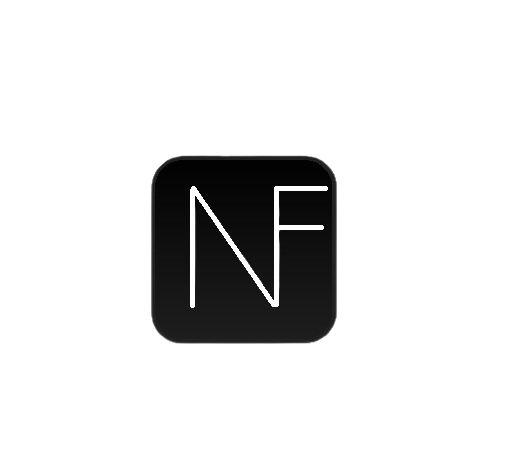

<div align="center">
  <h1>Nexfuse Framework</h1>
  
  <br/>
</div>


# Nexfuse Framework

Nexfuse is a Python-based framework inspired by the NSA's Marble Framework, designed to enhance anti-forensics techniques for malware developers. This tool is made using AI, it translate comments within code written in various programming languages into different languages such as Russian, Chinese, Arabic, Urdu, and English. By obfuscating comments through translation, Nexfuse aims to make it more challenging for analysts to trace the origin and intent of the code, thereby aiding in evading forensic detection. Although this is my first time making a framework and I am not an experienced programmer, I have tried my best to create a functional tool. I will not be responsible for any illegal activity carried out using this tool.

## Important ⚠️

This Code is unstable and it is in development large, the app does not respond when it tries to translate a big chunk of code, because python is slow. So we are trying to fix this ISSUE. Thank You

## Installation

Clone repository 

```bash
  git clone https://github.com/B1ade-Z/NexFuse/
  cd NexFuse
  pip install customtkinter deep-translator
  python3 NexFuse.py
```
or 

https://github.com/B1ade-Z/NexFuse/releases/tag/v1.0

## Supported Programming language

- Python
- C++
- C
- Rust
- Golang
- Shell Script

## Features

- Mordern UI
- Live Translate
- Multiple Language Support
- Made using AI

## Upcoming Features

- Code Obfuscation
- More language Support

## Creator

- [@Blade-Z](https://www.github.com/B1ade-Z)


## Tool Preview


